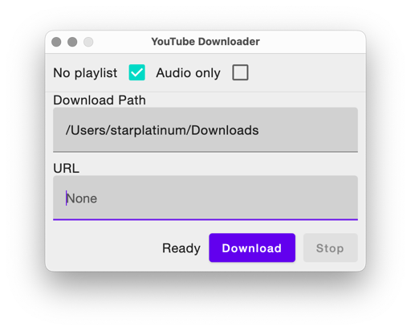

# YouTube Downloader

## TL;DR

A simple GUI application to download youtube videos

## Screenshot



## Requirements

- [yt-dlp](https://github.com/yt-dlp/yt-dlp) installed via [homebrew](https://github.com/Homebrew/brew)
- [ffmpeg](https://github.com/FFmpeg/FFmpeg) installed via [homebrew](https://github.com/Homebrew/brew)
- Java 17

## Run

```shell
./gradlew run
```

## Build

Single binary

```shell
./gradlew createDistribution
```

Package

```shell
./gradlew packageDmg
```